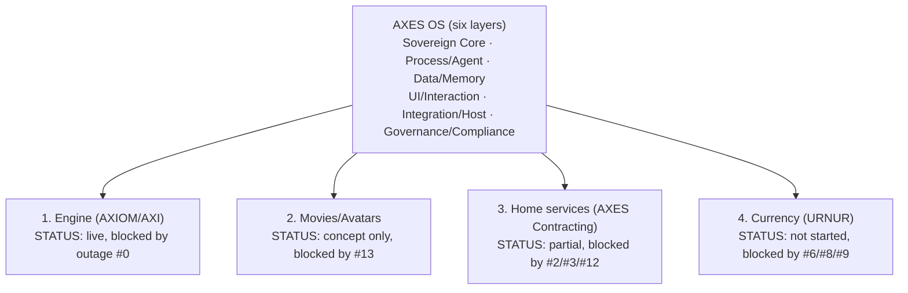

# AXES OS: unified platform breakdown (engine, movies/avatars, home services, currency)

**Status:** Synthesis document only — organizes and cross-references already
existing documentation into one "one OS, many production lines" view. It
introduces no new commitments, approves no new spend, and does not move any
item past the founder-decision gates already recorded elsewhere.
**Recorded:** 2026-09-18
**Trigger:** Founder asked for a single-OS breakdown covering "the entire
engine, movies, avatars, home services, currency etc."

## The core idea: one OS, many production lines

`docs/AXES_OS_VISION_AND_ARCHITECTURE.md` already defines AXES OS as six
layers (Sovereign Core, Process & Agent, Data & Memory, UI & Interaction,
Integration & Host, Governance & Compliance). Every product line the founder
has described — the AXIOM engine, movies/avatar reanimation, AXES Contracting
home services, and URNUR currency — is not a separate system to build from
scratch; each is a **tenant application running on top of the same six
layers**, the way multiple apps run on one phone OS. This document maps each
one onto those layers and states its real, current build status honestly.

## The four production lines

### 1. The engine (AXIOM / AXI)

- **What it is:** The constitutional chat engine, identity/date system
  prompt, automation console, and memory store.
- **OS layers it occupies:** Sovereign Core (identity/rules) + Process &
  Agent Layer (automation console) + Data & Memory Layer (chat memory store).
- **Build status: substantially built and live.** `apps/axiom-engine` +
  `apps/axiom-freedom`, deployed on Railway at `xiiom.com`, with persistent
  chat memory (PR #73) and identity/date system prompt (PR #95) already
  merged.
- **Current blocker:** Live production outage — `xiiom.com/api/axiom` chat
  endpoint returns HTTP 502 (queue item **#0**, unresolved 13+ hours as of
  last check; requires founder action in the Railway dashboard, not a code
  fix).
- **This is the foundation everything else depends on** — every other
  production line below assumes the engine is reachable.

### 2. Movies / avatars (AI reanimation)

- **What it is:** The newly proposed "free-to-all image upload, reanimate
  into full-length AI avatars using submitted music" production line under
  AXES Contracting Inc.
- **OS layers it would occupy:** A new tenant app sitting on the UI &
  Interaction Layer (upload/gallery front end) and Integration & Host Layer
  (AI vendor or self-hosted model), governed by the Governance & Compliance
  Layer (moderation, legal disclaimers).
- **Build status: concept + readiness doc only, nothing built.** The
  *curated* precursor (`urartuhi.com`'s manifest-driven gallery, bulk upload,
  masonry grid, tag filtering) is live and working, but that is
  founder-curated content, not public upload.
- **Current blocker:** Queue item **#13** — public upload triggers a
  mandatory CSAM-detection/reporting legal requirement (not optional), plus
  real per-generation AI compute cost and a copyright reality check (AI-only
  output isn't copyrightable under current US law — see
  `AXES_CONTRACTING_AI_AVATAR_PRODUCTION_READINESS.md`). Needs founder
  approval on moderation approach, AI vendor/budget, and hosting before any
  code is written.

### 3. Home services (AXES Contracting)

- **What it is:** AXES Contracting Inc's actual service business —
  historically (2018–2025, per the Wayback Machine record) property/home
  inspection and hazard remediation; currently documented forward plan is
  design/materials consultation.
- **OS layers it occupies:** Mostly outside the six software layers — this
  is the *real-world service delivery* tenant, connected to AXES OS only
  through its public-facing pages (`axescontracting.com` studio page,
  `xiiom.com/axescontracting`) and any future intake/scheduling app (UI &
  Interaction Layer) or automation (Process & Agent Layer).
- **Build status: partially built, not activated.**
  `AXES_DESIGN_MATERIALS_CONSULTATION_READINESS.md` exists; the public
  studio page and private command-center routing both exist and are live;
  no paid service has actually been approved/turned on yet.
- **Current blockers:** Queue item **#2** (approve the first paid service
  to actually accept clients for), item **#3** (DNS/HTTPS cert for
  `axescontracting.com`), item **#12** (confirm whether the real,
  decade-plus licensed home-inspection/remediation business is still active
  — if so, that is a far more revenue-ready offering than a from-scratch
  consultation service, but licensed/regulated work cannot be publicly
  claimed without confirming current licensing/insurance status).
- **Per `FOUNDER_REVENUE_PRIORITY_OVERLAY.md`, this (as "V2 AXES") is
  already the founder's own designated first-revenue track** — of the four
  production lines in this document, it is the closest to real, lawful,
  near-term revenue once items #2/#3/#12 are resolved.

### 4. Currency (URNUR)

- **What it is:** A proposed future monetary currency / bank or financial
  institution, plus a separate non-monetary contributor-recognition layer,
  plus the "eternal par value" origin-currency concept.
- **OS layers it would occupy:** Would eventually touch every layer (Data &
  Memory for balances/records, Governance & Compliance heavily, UI for
  wallets/accounts) but currently touches **none of them** — no code exists.
- **Build status: not started, and explicitly blocked.**
  `URNUR_FINANCIAL_READINESS.md` is a standing legal-review gate: no
  currency, deposit, payment, transfer, custody, trading, or token-issuance
  code may be written before qualified banking/financial-services/digital-
  asset counsel defines a written permitted scope for the launch
  jurisdiction. Only the non-monetary contributor-recognition layer
  (`URNUR_NON_MONETARY_RECOGNITION.md`) has any permitted design work today,
  and even that must stay opt-in, human-reviewed, and non-financial.
- **Current blockers:** Queue items **#6** (define URNUR's permitted scope
  or confirm it stays inactive), **#8**/**#9** (reconcile the "evolving
  name = value" / automated arbitration concept with the existing
  non-monetary constitution — currently self-conflicting). **This is the
  most gated of the four production lines** — of everything in this
  document, currency is the furthest from any buildable next step.

## How the four lines actually relate to "one OS"

The engine is not "one of four equal apps" — it is the substrate the other
three would eventually run on (chat/automation for customer intake, memory
for account/provenance records, etc.), which is why its live outage (#0) is
still the single highest-priority blocker across the whole platform.

## Recommended build order (given real revenue readiness and legal risk)

This is a synthesis of priorities **already set** by the founder and
recorded in `FOUNDER_REVENUE_PRIORITY_OVERLAY.md` and
`FOUNDER_ACTION_QUEUE.md` — not a new decision:

1. **Fix the engine outage (#0)** — nothing else matters if the flagship
   product is down; founder-only Railway action.
2. **Activate home services (#2, #3, #12)** — already the founder's
   designated "V2" first-revenue track, lowest legal complexity of the
   remaining three once licensing status (#12) is confirmed.
3. **Resolve currency scope (#6, #8, #9)** — not because it's next in
   priority, but because it is purely a scoping/legal decision with zero
   engineering cost until counsel is engaged; can happen in parallel with
   #2 rather than blocking it.
4. **Movies/avatars (#13)** — the newest and least-developed line; the
   curated-upload precursor (`urartuhi.com`) is already working proof that
   the underlying "manifest + bulk content" pattern is sound, but the
   public-upload/AI-generation leap needs its own moderation and budget
   approval before any build work starts.

## What this document does not do

It does not approve building any of items #13 (avatars), #6/#8/#9
(currency), or new home-services offerings beyond what's already queued. It
does not commit engineering time beyond what's already scheduled in
`AXES_BUILD_PROGRAM.md`. It exists so the founder can see, in one place, how
every "build the whole thing" request maps onto work that is either already
done, already queued, or still gated on a decision only the founder (with
counsel, where noted) can make.

## Related records

- `docs/AXES_OS_VISION_AND_ARCHITECTURE.md` (the six-layer architecture this
  document maps onto)
- `docs/keystone/AXES_OS_APP_INVENTORY_AND_ARCHITECTURE.md` (a separate,
  founder-shared app-by-app inventory)
- `docs/keystone/FOUNDER_ACTION_QUEUE.md` (items #0, #2, #3, #6, #8, #9,
  #12, #13 referenced above)
- `docs/FOUNDER_REVENUE_PRIORITY_OVERLAY.md` (V1/V2/V3 sequencing this
  document's recommended order is drawn from)
- `docs/AXES_CONTRACTING_AI_AVATAR_PRODUCTION_READINESS.md`
- `docs/URNUR_FINANCIAL_READINESS.md`
- `docs/keystone/PRODUCT_BRANCH_DOMAIN_MAP.md`
